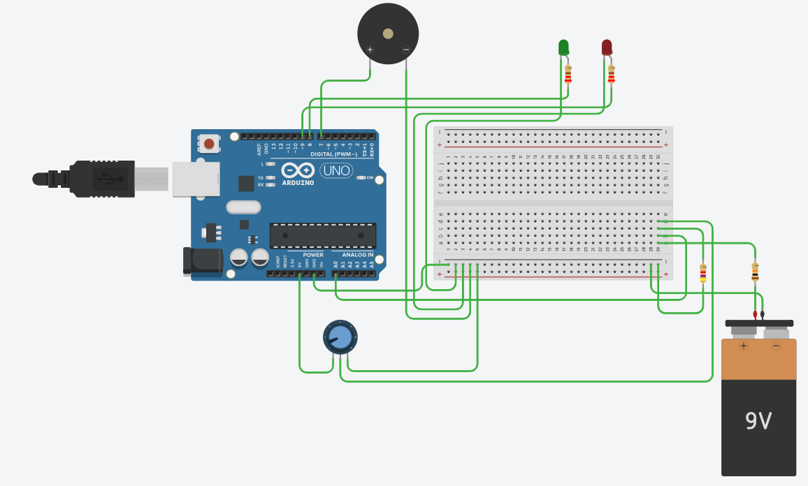
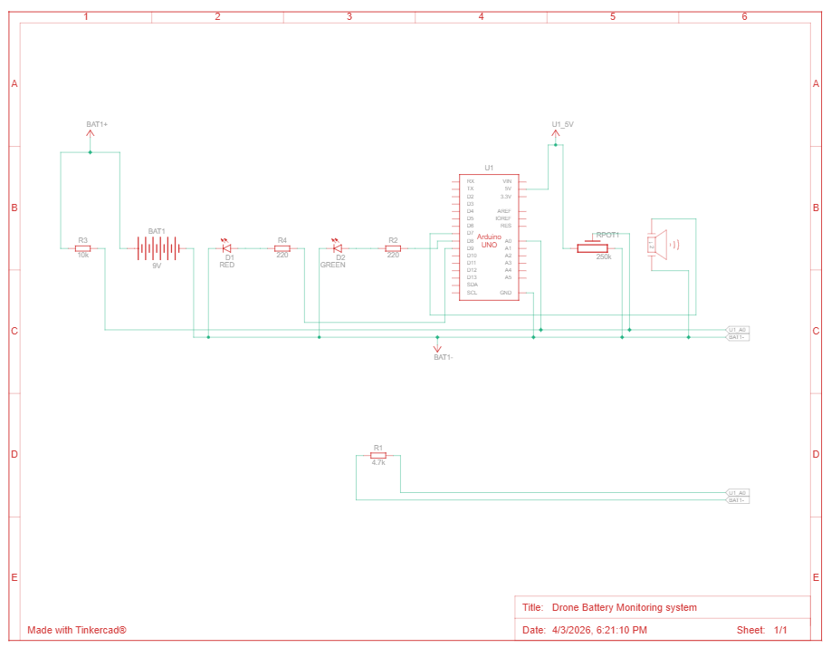

# Drone Battery Monitoring System

## What it does
This simulation monitors a drone battery’s voltage and indicates battery health in real time. A green LED shows normal battery level, while a red LED and buzzer warn when voltage drops below a safe threshold. It also prints battery voltage and estimated percentage to the serial monitor.

## Components
- 1 Arduino Uno R3
- 1 9V Battery
- 1 4.7 kΩ Resistor
- 1 10 kΩ Resistor
- 2 220 Ω Resistor
- 1 Red LED
- 1 Green LED
- 1 Piezo
- 1 250kΩ Potentiometer

## Circuit

## How it works
The battery voltage is connected to the Arduino through a voltage divider network (10kΩ and 4.7kΩ resistors) so that the analog input pin can safely measure voltages higher than 5V. The Arduino reads this scaled voltage through pin A0, converts the ADC value into actual battery voltage, and applies the divider ratio to estimate the original battery voltage. A potentiometer is used in simulation to vary the input voltage and imitate battery discharge conditions.

The program continuously compares the measured voltage with a predefined low-battery threshold (7.4V for a 2S Li-Po battery). If the voltage remains above the threshold, the green LED stays ON, indicating safe operation. When the voltage falls below the threshold, the green LED turns OFF, the red LED turns ON, and the buzzer generates an intermittent warning signal. At the same time, voltage, battery percentage, and status are displayed in the serial monitor for monitoring and debugging.

## Code
See [propeller_speed_control.ino](./drone_battery_monitoring_system.ino)

## TinkerCAD Link
[Open simulation](https://www.tinkercad.com/things/jI1N4k8MNIP-drone-battery-monitoring-system?sharecode=DTm3N3sKtq-IIkjreEVWwgT-7oFTH24hWKhZgv1KUgw)
